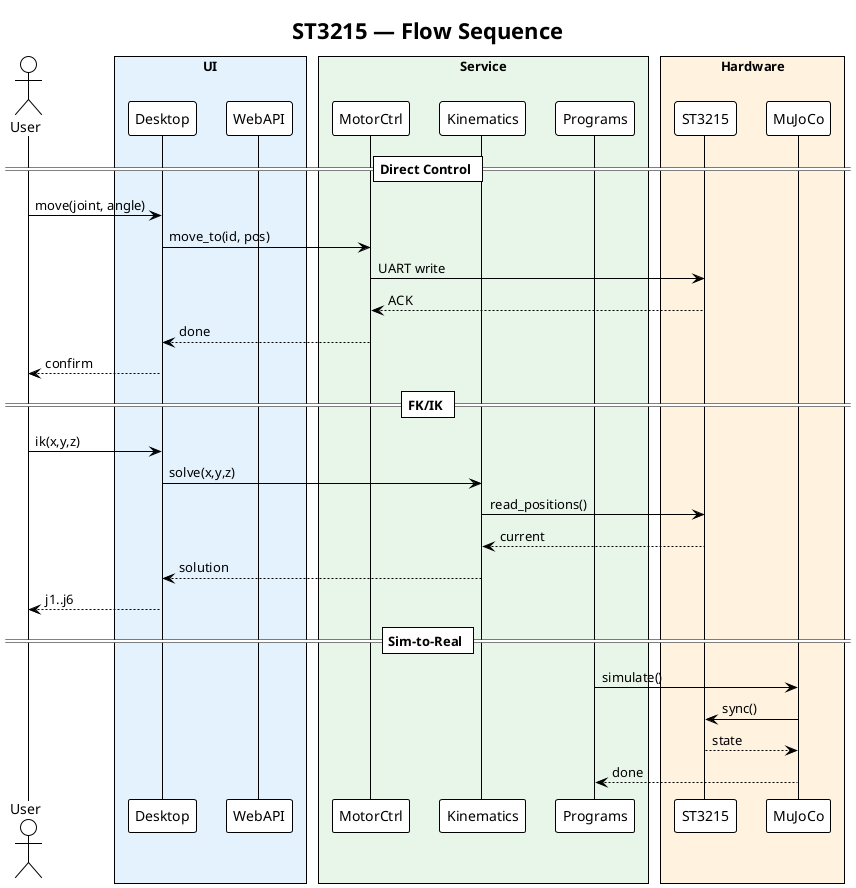

# ST3215 Robot Control System

Программное обеспечение для управления 6-осевым манипулятором на базе сервоприводов ST3215.

---

## Описание

Проект включает полный цикл управления роботом-манипулятором:

- **Desktop-приложение** — Tkinter GUI с 3D-визуализацией
- **Web-интерфейс** — REST API + WebSocket на FastAPI
- **ROS2-интеграция** — управление через топики и сервисы
- **MuJoCo-симуляция** — физически точная симуляция для RL

| Модуль | Строки | Описание |
|--------|-------|----------|
| Desktop GUI | ~1000 | Tkinter, Matplotlib 3D |
| Web API | ~500 | FastAPI, WebSocket |
| ROS2 | ~400 | Ноды, топики |
| MuJoCo | ~600 | Симуляция, RL |
| Тесты | ~1700 | Unit + Integration |

---

## Установка

```bash
git clone https://github.com/your-repo/diplome.git
cd diplome
pip install -r requirements.txt
```

### Требования

- Python 3.12+
- MuJoCo 3.0+
- ROS2 (для робо-интеграции)

---

## Быстрый старт

### Desktop-приложение

```bash
python -m app.main
```

### Web-сервер

```bash
python -m web.main
# Открыть http://localhost:8000
```

### MuJoCo

```bash
cd mujoco_sim
python main.py
```

---

## Архитектура

```
┌──────────────────────────────────────────────────────────────────────────────┐
│                        UI Layer                                 │
│  ┌──────────────┐  ┌──────────────┐  ┌──────────────┐        │
│  │   Desktop   │  │     Web     │  │    ROS2     │        │
│  │  (Tkinter)  │  │  (FastAPI)  │  │   (rclpy)   │        │
│  └──────┬──────┘  └──────┬──────┘  └──────┬──────┘        │
└─────────┼────────────────┼──────────────┼─────────────────┘
          │                │              │
          ▼                ▼              ▼
┌──────────────────────────────────────────────────────────────────────────────┐
│                     Service Layer                                │
│  ┌──────────────┐  ┌──────────────┐  ┌──────────────┐            │
│  │    Motor    │  │  Kinematics  │  │  Programs  │            │
│  │ Controller │  │   (FK/IK)   │  │   System   │            │
│  └──────┬──────┘  └──────┬──────┘  └──────┬──────┘            │
│         │                │              │                      │
│         └────────────────┼──────────────┘                      │
│                          ▼                                      │
│  ┌──────────────┐  ┌──────────────┐                            │
│  │   EventBus   │  │   Config    │                            │
│  │   (pub/sub) │  │   Manager   │                            │
│  └──────────────┘  └──────────────┘                            │
└──────────────────────────────────────────────────────────────────────────────┘
          │                │              │
          ▼                ▼              ▼
┌──────────────────────────────────────────────────────────────────────────────┐
│                   Hardware / Simulation                            │
│  ┌──────────────┐  ┌──────────────┐  ┌──────────────┐            │
│  │   ST3215    │  │ DH/FK/IK    │  │   MuJoCo    │            │
│  │   (UART)   │  │   Math      │  │  Physics    │            │
│  └──────────────┘  └──────────────┘  └──────────────┘            │
└──────────────────────────────────────────────────────────────────────────────┘
```

### PlantUML (Sequence)



---

## Кинематика

Прямая кинематика (FK) вычисляется через параметры Денавита–Хартенберга:

| Сустав | Ось | a (мм) | α (°) | d (мм) | θ (°) |
|--------|-----|--------|------|--------|-------|
| J1 | Z | 0 | 0 | L0 | θ₁ |
| J2 | Y | L1 | -90 | 0 | θ₂ |
| J3 | Y | L2 | -90 | 0 | θ₃ |
| J4 | Y | L3 | -90 | 0 | θ₄ |
| J5 | Z | L4 | 0 | 0 | θ₅ |
| J6 | Y | 0 | 0 | 0 | θ₆ |

Обратная кинематика (IK) решается методом DLS (Damped Least Squares).

---

## Тестирование

### Модульные тесты

```bash
pytest tests/unit/ -v
```

### Интеграционные

```bash
pytest tests/integration/ -v
```

### Системные

```bash
python -m app.main --test-mode
```

---

## REST API

| Метод | Endpoint | Описание |
|-------|----------|----------|
| GET | `/motors` | Список моторов |
| POST | `/motors/{id}/move` | Движение к позиции |
| POST | `/kinematics/fk` | Прямая кинематика |
| POST | `/kinematics/ik` | Обратная кинематика |
| GET | `/ws/status` | WebSocket статус |

---

## Схема ROS2

```
/robot/joint_states
    └── sensor_msgs/msg/JointState

/robot/cmd
    └── trajectory_msgs.msg/JointTrajectoryPoint

/robot/tf
    └── tf2_msgs.msg/TFMessage
```

---

## Структура проекта

```
diplome/
├── app/
│   ├── config/          # Константы
│   ├── controllers/    # MotorController, Monitor
│   ├── models/         # MotorData, Kinematics
│   ├── views/          # Tkinter GUI
│   ├── api/            # FastAPI
│   └── programs/        # Задачи
├── mujoco_sim/         # MuJoCo симуляция
├── tests/             # Тесты
├── docs/              # Документация
└── ros2_pkgs/         # ROS2 пакеты
```

---

## Лицензия

MIT License
